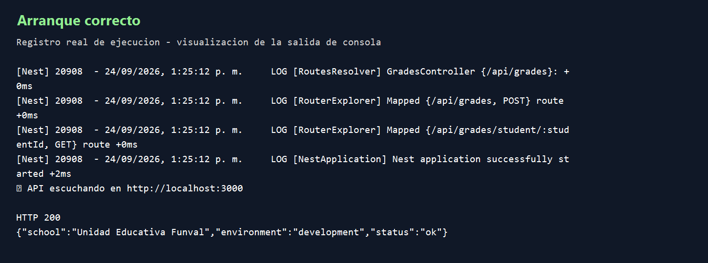
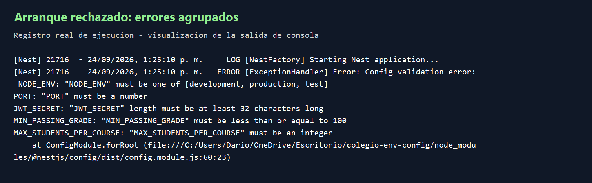

# Configuración de entornos

## Qué cambió

Las reglas de las 10 variables están en `src/config/env.validation.ts`. Joi comprueba los valores cuando inicia la aplicación. Si falta una variable obligatoria o tiene un valor incorrecto, la aplicación no arranca.

`ConfigModule` se registra una sola vez en `AppModule` y es global. Los servicios usan `ConfigService` para leer la configuración. En JWT se usa `registerAsync` para obtener el secreto y la duración después de cargar las variables.

Por ejemplo, `PORT=abc` produce un error al iniciar. Es mejor encontrarlo en ese momento que esperar a que alguien intente usar la API. Lo mismo ocurre si el secreto de JWT es demasiado corto.

En el esquema:

- `required()` indica que la variable es obligatoria.
- `default()` establece un valor cuando la variable no está definida.
- `abortEarly: false` permite mostrar todos los errores juntos.
- `allowUnknown: true` permite otras variables del sistema operativo.

## Pruebas

La compilación pasó. También se comprobó el arranque y la respuesta de `/api`. Con varias variables incorrectas, la consola mostró los errores juntos.

El comando `npm run test:config` revisa las reglas, los valores por defecto, el login, las rutas protegidas, las rondas de bcrypt, la nota mínima y el cupo de estudiantes. Estas pruebas simulan el acceso a datos; no comprueban una base PostgreSQL real.

`.env.example` contiene valores válidos de ejemplo. `.env` está ignorado por Git y no se sube al repositorio.

## Evidencias

Las imágenes muestran los registros reales de las pruebas. Son imágenes generadas a partir del texto, no capturas del escritorio; quedan pendientes las capturas literales que pide la consigna.

También están los registros originales: [arranque](docs/evidence/valid-startup.txt), [errores](docs/evidence/invalid-startup.txt) y [respuesta HTTP](docs/evidence/http-response.txt).

## Cómo ejecutarlo

1. Ejecutar `npm install`.
2. Copiar `.env.example` a `.env` y configurar la conexión a PostgreSQL.
3. Ejecutar `npm run db:generate` y `npm run build`.
4. Iniciar con `npm run start:prod`.

Para usar las rutas que consultan datos, primero hay que preparar PostgreSQL con las migraciones y el seed que indica el README.
